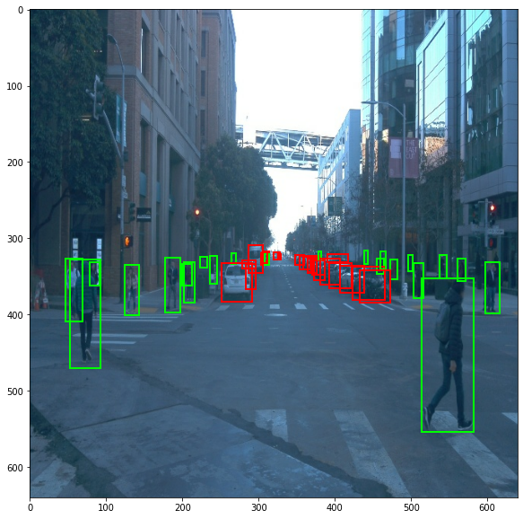

### Project overview
Object Detection in an Urban Environment project is ment to use pretrained Convolutional Neural Network CNN SSD Resnet 50 640x640 model to show basical principles of using pretrained model for object detection by using [Waymo Open dataset](https://waymo.com/open/). In this project pretrained model will be used to retrain and than used for validationa and testing.
Self driving cars need information of their surroundings and they receive this information from the sensors like camera, Lidar, Radar etc. and base on this information they decide for their actions. Object detection is one of the most important concepts in Self-Driving cars because by object detection self driving car can identify oder participants on the road like other cars, cyclist, pedestrians etc.

### Set up
In order to use this project, project files should be obtained from [GitHub repository](https://github.com/atanasko/Object-Detection-in-an-Urban-Environment.git).
Project code can be executed localy only on a machine with Nvidia GPU and appropriate libraries. Python 3 is also required on a local machine. In order to execute Jupyter notebooks appropriate package is required locally installed.

### Dataset
#### Dataset analysis

During the dataset exploratory analysis we can notice that most of the images are taken in urban environment and on a sunny weather. There are some of the images on the open road. Very few of the images are in rainy, cloudy and night weather.

Here are some images from the analysis

##### Dataset class distribution

#### Cross validation

Cross validation is a set of techniques to evaluate the capacity of our model to generalize and alleviate the overfitting challenges. In this project cross validation strategy is used where we split the available dataset in training and validation subsets. Splitting is done following the rule 80% - 90% goes in the training dataset, and the 10% - 20% goes in validation dataset.

### Training
#### Reference experiment

Next result from training and validation from reference training and experiment with changed parameters are displayed.

Reference training and validation graphs

Loss graph

Learning rate graph

Precission graph

Recall graph

Training loss is decreasing, hence the model is converging, since we are using ssd model and it generally overfits, the validation loss is also decreasing, meaning that the model is able to generalize to the validation set.

Experiment training and validation graphs

In this experimnt two parameters are changed in the pipline file

 data_augmentation_options {
    random_rgb_to_gray {
      probability: 0.2
    }
  }
  data_augmentation_options {
    random_adjust_brightness {
      max_delta: 0.4
    }
  }

and here are result graphs

Loss graph

Learning rate graph

Precission graph

Recall graph

#### Improve on the reference

During the dataset exploratory analysis we can notice that most of the images are taken in urban environment and on a sunny weather. There are some of the images on the open road. Very few of the images are in rainy, cloudy and night weather. Because of this by using explore augmentations notebook we can add some augmentations to improve the dataset like random_rgb_to_gray and random_adjust_brightness.
